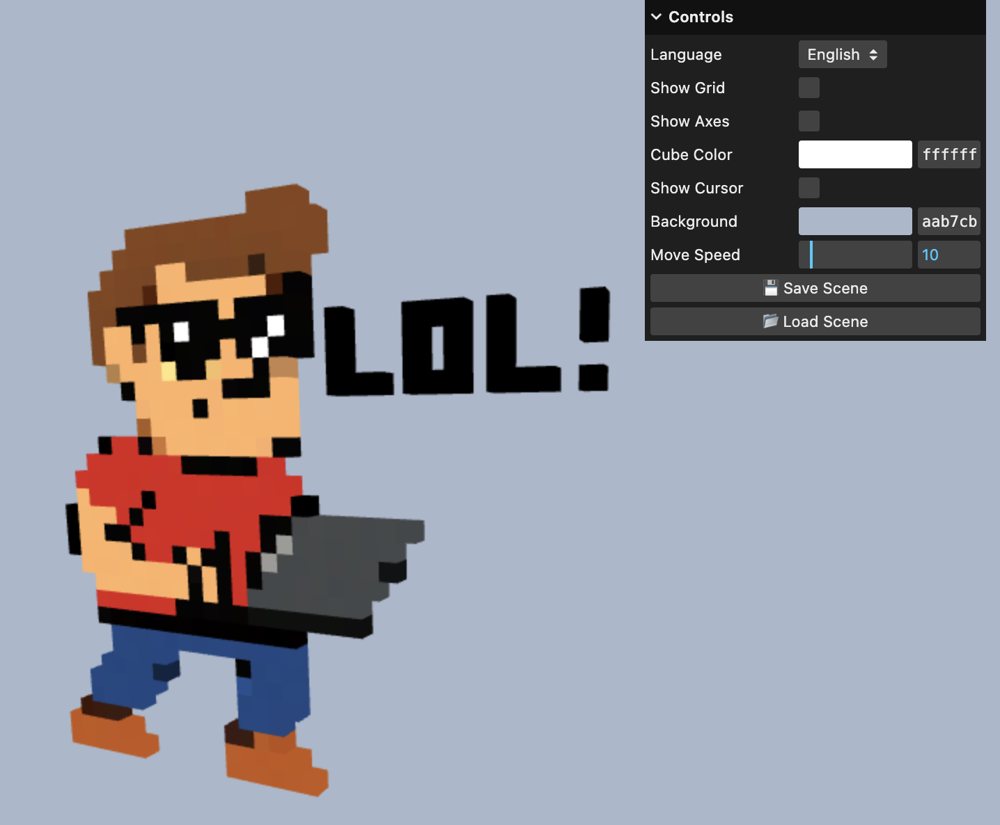

# 🎨 Cube Art Project 2 Online: Cooperative Voxel Editor
Build together! Craft colorful, cube-based art in a live, voxel-style editor with a new multiplayer feature.

Connect with friends to place and color individual cubes in real-time, experimenting with abstract 3D art and geometric designs—all directly in your browser.

---

## ✨ Features

- 🌐 Multiplayer Canvas: Build, color, and collaborate on a single creation simultaneously with other players.
- 🧱 **Voxel-style cube grid** – place and color individual cubes
- 🌈 **RGB sliders** – tweak colors in real time
- 🖱️ **Interactive UI** – change cube colors instantly with a simple control panel
- 🎨 **Creative canvas** – perfect for experimenting with abstract 3D art

---

## 🕹 Try It Live

👉 **[Play Live](https://demensdeum.com/software/cube-art-project-2-online/)**

Runs entirely in your browser. No install needed.
